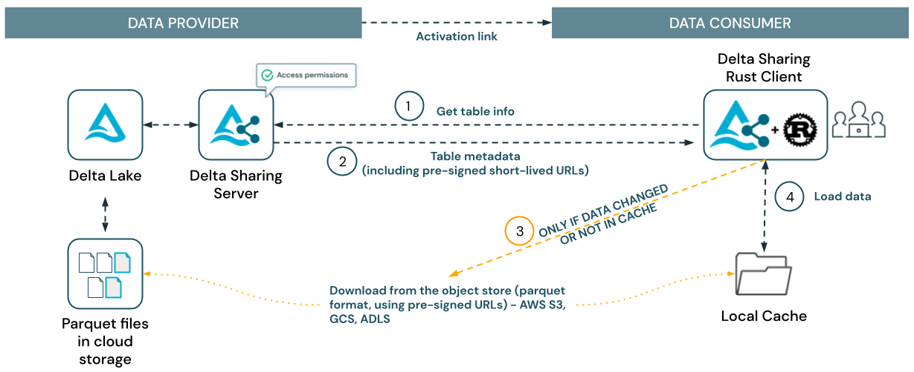

     

# Delta Sharing client library for Rust 

*Please note that this project is currently experimental.*

This is a simple library for Rust to access data published via Delta Sharing. Under the hood, it uses HTTP APIs exposed by Delta Sharing.

[Delta Sharing](https://delta.io/sharing/) is an open protocol for secure data sharing, making it simple to share data with other organizations regardless of which computing platforms they use.

## Features

- Retrieve Delta Sharing information (shares, schemas, tables and files).
- Query shared table data using [Polars](https://pola-rs.github.io/polars/polars/index.html). `get_dataframe` downloads the table's parquet files (and caches then locally for subsequent queries) and returns a lazy abstraction (logical plan) over an eager DataFrame. This lazy abstraction provides methods for incrementally modifying that logical plan until output is requested (via `collect`).
- Provides both an async Client (`delta_sharing::Client`) and a blocking one (`delta_sharing::blocking::Client`).

## Pre-requisites

- Rust is installed, e.g. as described [here](https://doc.rust-lang.org/cargo/getting-started/installation.html)

- [Delta Sharing](https://delta.io/sharing/) is set up with at least one shared table 

    This library uses [profile files](https://github.com/delta-io/delta-sharing/blob/main/PROTOCOL.md#profile-file-format), which are JSON files containing a user's credentials to access a Delta Sharing Server. There are several ways to get started:

    - Download the profile file to access an open, example Delta Sharing Server that we're hosting [here](https://databricks-datasets-oregon.s3-us-west-2.amazonaws.com/delta-sharing/share/open-datasets.share). You can try the connectors with this sample data.
    - Start your own [Delta Sharing Server](https://github.com/delta-io/delta-sharing#delta-sharing-reference-server) and create your own profile file following [profile file format](https://github.com/delta-io/delta-sharing/blob/main/PROTOCOL.md#profile-file-format) to connect to this server.
    - Download a profile file from your data provider.

## Quick start

- Clone the repo
- Set the `bearerToken` and `endpoint` values in the `config.json` to match your Delta Sharing information.
- Run a simple example included with the library that uses an async client: `cargo run --example async`. When executed, it will get and display all the data from the first Data Sharing table it finds. 
- For an example of using a blocking version of the client to do the same, try `cargo run --example blocking --features blocking`.

## Using in your own project

Add `delta-sharing` to your `Cargo.toml`

## Development

- Run all tests: `cargo test --features blocking` (or `RUST_LOG=debug cargo test --features blocking` for extra troubleshooting)
- Run async client tests only: `cargo test`
- Style check: `cargo fmt -- --check`